# Voice-Enabled Task Tracker - Architecture Documentation

## 📐 System Architecture Overview

This document provides a comprehensive view of the Voice-Enabled Task Tracker architecture, including all components, services, data flow, and interactions.

---

## 1. High-Level System Architecture

```mermaid
graph TB
    subgraph ClientLayer["🖥️ CLIENT LAYER"]
        Browser["Web Browser<br/>(Chrome/Edge/Safari)"]
        WebSpeech["Web Speech API<br/>(Google STT)"]
    end
    
    subgraph FrontendLayer["⚛️ FRONTEND LAYER - React 19.2.0"]
        ReactUI["React UI Components<br/>(App.jsx)"]
        StateManagement["State Management<br/>(React Hooks)"]
        APIServices["API Services<br/>(Axios)"]
    end
    
    subgraph BackendLayer["🔧 BACKEND LAYER - Node.js/Express 5.2.1"]
        ExpressAPI["Express REST API<br/>(Routes)"]
        Middleware["Middleware<br/>(CORS, Validation, Errors)"]
        Controllers["Controllers<br/>(Request Handlers)"]
        Services["Services<br/>(Business Logic)"]
        NLPParser["NLP Parser<br/>(Chrono-node)"]
    end
    
    subgraph DataLayer["💾 DATA LAYER"]
        MySQL["MySQL 8.0+ Database<br/>(tasks table)"]
    end
    
    Browser --> ReactUI
    WebSpeech --> ReactUI
    ReactUI --> StateManagement
    StateManagement --> APIServices
    APIServices -->|HTTP/REST| ExpressAPI
    ExpressAPI --> Middleware
    Middleware --> Controllers
    Controllers --> Services
    Services --> NLPParser
    Services --> MySQL
    
    style ClientLayer fill:#e3f2fd
    style FrontendLayer fill:#f3e5f5
    style BackendLayer fill:#fff3e0
    style DataLayer fill:#e8f5e9
```

---

## 2. Detailed Frontend Component Architecture

```mermaid
graph TB
    subgraph AppContainer["App.jsx - Main Container"]
        StateMgmt["State Management<br/>(useState, useEffect)"]
    end
    
    subgraph ViewComponents["📊 VIEW COMPONENTS"]
        TaskBoard["TaskBoard.jsx<br/>(Kanban View)"]
        TaskList["TaskList.jsx<br/>(List View)"]
        TaskCard["TaskCard.jsx<br/>(Task Display)"]
        DraggableCard["DraggableTaskCard.jsx<br/>(Drag Wrapper)"]
    end
    
    subgraph FormComponents["📝 FORM COMPONENTS"]
        TaskForm["TaskForm.jsx<br/>(Create/Edit)"]
        VoiceInput["VoiceInput.jsx<br/>(Voice Recorder)"]
        VoiceReview["VoiceTaskReview.jsx<br/>(Review Parsed)"]
    end
    
    subgraph UIComponents["🎨 UI COMPONENTS"]
        SearchFilter["SearchFilter.jsx<br/>(Search & Filters)"]
        ThemeToggle["ThemeToggle.jsx<br/>(Dark Mode)"]
        LoadingAnim["LoadingAnimation.jsx<br/>(Welcome Screen)"]
        ConfirmDialog["ConfirmDialog.jsx<br/>(Delete Confirm)"]
    end
    
    subgraph Services["🔌 SERVICES"]
        TaskService["taskService.js<br/>(API Calls)"]
        APIClient["api.js<br/>(Axios Instance)"]
    end
    
    subgraph Libraries["📚 LIBRARIES"]
        Tailwind["Tailwind CSS 3.3.0"]
        DndKit["@dnd-kit 6.3.1/10.0.0"]
        Framer["Framer Motion 12.23.25"]
        Vite["Vite 7.2.5"]
    end
    
    AppContainer --> StateMgmt
    StateMgmt --> TaskBoard
    StateMgmt --> TaskList
    StateMgmt --> TaskForm
    StateMgmt --> VoiceInput
    StateMgmt --> VoiceReview
    StateMgmt --> SearchFilter
    StateMgmt --> ThemeToggle
    StateMgmt --> LoadingAnim
    StateMgmt --> ConfirmDialog
    
    TaskBoard --> DraggableCard
    DraggableCard --> TaskCard
    TaskList --> TaskCard
    TaskBoard --> ConfirmDialog
    
    TaskForm --> TaskService
    VoiceInput --> TaskService
    VoiceReview --> TaskService
    TaskService --> APIClient
    
    AppContainer --> Tailwind
    TaskBoard --> DndKit
    AppContainer --> Framer
    Vite --> AppContainer
    
    style AppContainer fill:#e3f2fd
    style ViewComponents fill:#f3e5f5
    style FormComponents fill:#fff3e0
    style UIComponents fill:#e8f5e9
    style Services fill:#fce4ec
    style Libraries fill:#f1f8e9
```

---

## 3. Backend Architecture

```mermaid
graph TB
    subgraph Server["🚀 EXPRESS SERVER"]
        Entry["server.js<br/>(Entry Point)"]
    end
    
    subgraph Middleware["🛡️ MIDDLEWARE LAYER"]
        CORS["CORS 2.8.5<br/>(Cross-Origin)"]
        Validation["validation.js<br/>(Joi 18.0.2)"]
        ErrorHandler["errorHandler.js<br/>(Error Handler)"]
    end
    
    subgraph Routes["🛣️ ROUTES"]
        TaskRoutes["taskRoutes.js"]
    end
    
    subgraph Endpoints["📡 API ENDPOINTS"]
        GetAll["GET /api/tasks"]
        GetById["GET /api/tasks/:id"]
        Create["POST /api/tasks"]
        Update["PUT /api/tasks/:id"]
        Delete["DELETE /api/tasks/:id"]
        Voice["POST /api/tasks/voice"]
    end
    
    subgraph Controllers["🎮 CONTROLLERS"]
        TaskController["taskController.js<br/>(Request Handlers)"]
    end
    
    subgraph Services["⚙️ SERVICES"]
        TaskService["taskService.js<br/>(Business Logic)"]
    end
    
    subgraph Utils["🔧 UTILS"]
        NLPParser["nlpParser.js<br/>(Voice Parsing)"]
        Chrono["chrono-node 2.9.0<br/>(Date Extraction)"]
    end
    
    subgraph Models["📦 MODELS"]
        TaskModel["Task.js<br/>(Data Model)"]
    end
    
    subgraph Config["⚙️ CONFIG"]
        DBConfig["database.js<br/>(MySQL2 3.15.3)"]
        InitDB["initDatabase.js"]
        DotEnv["dotenv 17.2.3"]
    end
    
    subgraph Database["💾 DATABASE"]
        MySQL["MySQL 8.0+<br/>(tasks table)"]
    end
    
    Entry --> CORS
    Entry --> TaskRoutes
    Entry --> ErrorHandler
    Entry --> DotEnv
    
    TaskRoutes --> GetAll
    TaskRoutes --> GetById
    TaskRoutes --> Create
    TaskRoutes --> Update
    TaskRoutes --> Delete
    TaskRoutes --> Voice
    
    GetAll --> Validation
    Create --> Validation
    Update --> Validation
    Voice --> Validation
    
    Validation --> TaskController
    TaskController --> TaskService
    
    TaskService --> NLPParser
    NLPParser --> Chrono
    TaskService --> TaskModel
    
    TaskModel --> DBConfig
    DBConfig --> MySQL
    InitDB --> MySQL
    
    style Server fill:#e3f2fd
    style Middleware fill:#fff3e0
    style Routes fill:#f3e5f5
    style Endpoints fill:#e8f5e9
    style Controllers fill:#fce4ec
    style Services fill:#f1f8e9
    style Utils fill:#fff9c4
    style Models fill:#e0f2f1
    style Config fill:#fce4ec
    style Database fill:#c8e6c9
```

---

## 4. Voice Input Flow (Sequence Diagram)

---

## 5. Task Management Flow

---

## 6. Data Flow Architecture

---

## 7. Database Schema

**Indexes:**
- PRIMARY KEY: `id`
- INDEX: `idx_status` on `status`
- INDEX: `idx_priority` on `priority`
- INDEX: `idx_due_date` on `due_date`

**Example Data:**
| id | title | priority | status | due_date | created_at |
|----|-------|----------|--------|----------|------------|
| 1 | Complete proposal | high | todo | 2025-12-05 | 2025-12-02 |
| 2 | Review code | medium | in_progress | 2025-12-03 | 2025-12-02 |
| 3 | Team meeting prep | low | done | 2025-12-01 | 2025-11-30 |

---

## 8. API Endpoints Architecture

```mermaid
graph LR
    subgraph TaskEndpoints["📡 TASK MANAGEMENT ENDPOINTS"]
        GetAll["GET /api/tasks<br/>(Get all with filters)"]
        GetById["GET /api/tasks/:id<br/>(Get single task)"]
        Create["POST /api/tasks<br/>(Create task)"]
        Update["PUT /api/tasks/:id<br/>(Update task)"]
        Delete["DELETE /api/tasks/:id<br/>(Delete task)"]
    end
    
    subgraph VoiceEndpoint["🎤 VOICE PROCESSING"]
        Voice["POST /api/tasks/voice<br/>(Parse transcript)"]
    end
    
    subgraph Processing["⚙️ REQUEST PROCESSING"]
        Router["Express Router"]
        JoiValidation["Joi Validation"]
        Controller["Controller"]
        Service["Service Layer"]
        Model["Model Layer"]
        NLP["NLP Parser"]
        DB["MySQL Database"]
    end
    
    GetAll --> Router
    GetById --> Router
    Create --> Router
    Update --> Router
    Delete --> Router
    Voice --> Router
    
    Router --> JoiValidation
    JoiValidation --> Controller
    Controller --> Service
    Service --> Model
    Service --> NLP
    Model --> DB
    
    style TaskEndpoints fill:#e3f2fd
    style VoiceEndpoint fill:#f3e5f5
    style Processing fill:#fff3e0
```

---

## 9. Technology Stack

```mermaid
graph TB
    subgraph Frontend["⚛️ FRONTEND STACK"]
        React["React 19.2.0<br/>(UI Framework)"]
        Tailwind["Tailwind CSS 3.3.0<br/>(Styling)"]
        DndCore["@dnd-kit/core 6.3.1<br/>(Drag & Drop)"]
        DndSort["@dnd-kit/sortable 10.0.0<br/>(Sortable)"]
        Axios["Axios 1.13.2<br/>(HTTP Client)"]
        Framer["Framer Motion 12.23.25<br/>(Animations)"]
        WebSpeech["Web Speech API<br/>(Speech-to-Text)"]
        Vite["Vite 7.2.5<br/>(Build Tool)"]
    end
    
    subgraph Backend["🔧 BACKEND STACK"]
        Node["Node.js 18+<br/>(Runtime)"]
        Express["Express.js 5.2.1<br/>(Web Framework)"]
        Joi["Joi 18.0.2<br/>(Validation)"]
        Chrono["Chrono-node 2.9.0<br/>(NLP/Date Parsing)"]
        MySQL2["MySQL2 3.15.3<br/>(DB Driver)"]
        CORS["CORS 2.8.5<br/>(Cross-Origin)"]
        DotEnv["dotenv 17.2.3<br/>(Environment)"]
    end
    
    subgraph Database["💾 DATABASE"]
        MySQL["MySQL 8.0+<br/>(Relational DB)"]
    end
    
    subgraph External["🌐 EXTERNAL SERVICES"]
        GoogleSTT["Google Speech API<br/>(STT Service)"]
    end
    
    React --> Tailwind
    React --> DndCore
    React --> DndSort
    React --> Axios
    React --> Framer
    React --> WebSpeech
    Vite --> React
    
    Node --> Express
    Express --> Joi
    Express --> Chrono
    Express --> MySQL2
    Express --> CORS
    Node --> DotEnv
    
    MySQL2 --> MySQL
    WebSpeech -.-> GoogleSTT
    
    Axios -->|HTTP/REST| Express
    
    style Frontend fill:#e3f2fd
    style Backend fill:#fff3e0
    style Database fill:#e8f5e9
    style External fill:#f3e5f5
```

---

## 10. Deployment Architecture

---

## 11. Security Architecture

```mermaid
graph TB
    subgraph FrontendSecurity["🔒 FRONTEND SECURITY"]
        InputSanitization["Input Sanitization<br/>(XSS Prevention)"]
        HTTPS["HTTPS Only<br/>(Secure Transport)"]
        CSP["Content Security Policy<br/>(Header Protection)"]
    end
    
    subgraph BackendSecurity["🛡️ BACKEND SECURITY"]
        JoiValidation["Input Validation<br/>(Joi Schemas)"]
        SQLInjection["SQL Injection Prevention<br/>(Parameterized Queries)"]
        ErrorHandling["Error Handling<br/>(No Stack Traces)"]
        CORSConfig["CORS Configuration<br/>(Origin Whitelist)"]
    end
    
    subgraph DatabaseSecurity["💾 DATABASE SECURITY"]
        DBAuth["Database Authentication<br/>(Username/Password)"]
        Encryption["Data Encryption<br/>(At Rest & Transit)"]
        Backups["Regular Backups<br/>(Point-in-Time Recovery)"]
        ConnLimits["Connection Limits<br/>(Prevent DoS)"]
    end
    
    User["User Request"] --> HTTPS
    HTTPS --> InputSanitization
    InputSanitization --> CORSConfig
    CORSConfig --> JoiValidation
    JoiValidation --> SQLInjection
    SQLInjection --> DBAuth
    DBAuth --> Encryption
    Encryption --> Backups
    
    ErrorHandling -.-> User
    
    style FrontendSecurity fill:#ffebee
    style BackendSecurity fill:#fff3e0
    style DatabaseSecurity fill:#e8f5e9
```

---

## 12. Performance Optimization

---

## 13. Error Handling Flow

---

## 14. Component Interaction Matrix

| Component | Interacts With | Purpose |
|-----------|---------------|---------|
| **App.jsx** | All Components | Main container, state management |
| **TaskBoard** | TaskCard, DraggableTaskCard, ConfirmDialog | Kanban view with drag-and-drop |
| **TaskList** | TaskCard | List view display |
| **TaskForm** | taskService | Create/edit tasks |
| **VoiceInput** | Web Speech API, taskService | Voice recording |
| **VoiceTaskReview** | taskService | Review parsed voice input |
| **SearchFilter** | App.jsx state | Filter tasks by search/status/priority |
| **ThemeToggle** | localStorage | Toggle dark/light mode |
| **LoadingAnimation** | App.jsx | Welcome screen animation |
| **ConfirmDialog** | TaskBoard, TaskList | Delete confirmation |
| **taskService** | api.js, Backend API | API communication |
| **TaskController** | TaskService, Validation | Handle HTTP requests |
| **TaskService** | Task Model, NLP Parser | Business logic |
| **NLP Parser** | Chrono-node | Parse voice transcripts |
| **Task Model** | Database Config | Data operations |

---

## 15. Key Design Patterns

### Frontend Patterns
1. **Component Composition**: Reusable components with props
2. **Container/Presentational**: App.jsx (container) + UI components (presentational)
3. **Custom Hooks**: useState, useEffect for state management
4. **Service Layer**: Separate API logic from components
5. **Compound Components**: TaskBoard with DraggableTaskCard

### Backend Patterns
1. **MVC Architecture**: Models, Controllers, Services separation
2. **Middleware Pattern**: Validation, error handling, CORS
3. **Repository Pattern**: Task model abstracts database operations
4. **Dependency Injection**: Services injected into controllers
5. **Factory Pattern**: Database connection pooling

### Data Patterns
1. **RESTful API**: Standard HTTP methods and status codes
2. **DTO Pattern**: Data Transfer Objects for API responses
3. **Validation Pattern**: Joi schemas for input validation
4. **Active Record**: Task model with CRUD methods

---

## Summary

This architecture demonstrates:

✅ **Clear Separation of Concerns**: Frontend, Backend, Database layers  
✅ **Modular Design**: Reusable components and services  
✅ **RESTful API**: Standard HTTP methods and status codes  
✅ **Voice Input Integration**: Web Speech API + NLP parsing  
✅ **Scalable Structure**: Easy to extend and maintain  
✅ **Error Handling**: Comprehensive error management  
✅ **Security**: Input validation, SQL injection prevention  
✅ **Performance**: Indexes, connection pooling, optimization  

**Total Components**: 13 React components, 6 API endpoints, 8 backend modules  
**External Services**: Web Speech API (Google)  
**Database**: MySQL with 1 table, 4 indexes  
**Tech Stack**: React 19.2, Node.js, Express 5.2, MySQL 8.0+, Tailwind CSS 3.3, @dnd-kit, Framer Motion, Chrono-node

---

## 📊 Diagram Legend

- **Blue boxes**: Client/Frontend components
- **Yellow boxes**: Backend components
- **Green boxes**: Database/Data layer
- **Pink boxes**: External services
- **Solid arrows**: Direct connections
- **Dashed arrows**: Optional/external connections
